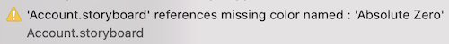
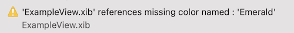
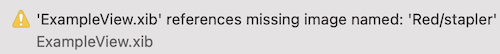

# Blackboard: An iOS Storyboard and Asset Manager

## Purpose

Blackboard is an iOS Storyboard, Localization and Asset Manager written in Swift.

## Requirements

- iOS 13.0+
- Xcode 11.0+
- Swift 5.1+

## Installation

- [Mint](/README/Installation/Mint.md#installation)
- [SwiftLint](/README/Installation/SwiftLint.md#installation)
- [CocoaPods](/README/Installation/CocoaPods.md#installation)
- [Manually](/README/Installation/Manually.md#installation)

## Configuration

- [Command Line](/README/Configuration/README.md#command-line)
- [Configuration File](/README/Configuration/README.md#configuration-file)

## Usage

The `DeclarativeApp` project uses Blackboard using `SwiftUI`.

The `ExampleApp` project uses Blackboard using `UIKit`.
The `StandardApp` project is the same as the `ExampleApp` project, except that it does not use Blackboard.
You compare these to see the difference between using and not using Blackboard.

- Asset Usage
  - CoreGraphics
    - [CGColor](/README/Usage/CGColor.md#cgcolor-usage)
  - SwiftUI
    - [Color](/README/Usage/Color.md#color-usage)
    - [Image](/README/Usage/Image.md#image-usage)
  - UIKit
    - [NSDataAsset](/README/Usage/NSDataAsset.md#nsdataasset-usage)
    - [UIColor](/README/Usage/UIColor.md#uicolor-usage)
    - [UIImage](/README/Usage/UIImage.md#uiimage-usage)
- Symbols
  - SwiftUI
    - [Image](/README/Usage/SymbolImage.md#symbol-image-usage)
  - UIKit
    - [UIImage](/README/Usage/SymbolUIImage.md#symbol-uiimage-usage)
  - SF Symbols App
    - [Collection](/README/Usage/SymbolCollection.md#symbol-collection-usage)
- Storyboard Usage
  - Cells
    - [Dequeue Collection View Cell](/README/Usage/UICollectionViewCell.md#dequeue-collection-view-cell-usage)
    - [Dequeue Table View Cell](/README/Usage/UITableViewCell.md#dequeue-table-view-cell-usage)
  - Controllers
    - [Instantiate Navigation Controller](/README/Usage/UINavigationController.md#instantiate-navigation-controller-usage)
    - [Instantiate View Controller](/README/Usage/UIViewController.md#instantiate-view-controller-usage)
  - Segues
    - [Perform Segue](/README/Usage/UIStoryboardSeguePerform.md#perform-segue-usage)
    - [Prepare Segue](/README/Usage/UIStoryboardSeguePrepare.md#prepare-segue-usage)
    - [Should Perform Segue](/README/Usage/UIStoryboardSegueShouldPerform.md#should-perform-segue-usage)
- Localization
  - [Localizable](/README/Usage/Localizable.md#localizable-usage)
  - [L Convenience](/README/Usage/L.md#l-convenience)

## Storyboard Resources Validation

Blackboard will also verify that the resources referenced in each processed storyboard exist.
When a storyboard is referencing a color or image that is no longer available,
one of the two following warning messages will be generate:

### Missing Named Color

### Missing Named Image

## Nib Resources Validation

Additionally, Blackboard will also verify that the resources referenced in nib files exist.
When a nib is referencing a color or image that is no longer available,
one of the two following warning messages will be generate:

### Missing Named Color

### Missing Named Image

### San Francisco Symbol
- [Symbol Availability](README/SymbolAvailability.md#symbol-availability)

## Authors

- Nathan E. Walczak, knate@knate.com
- Jon Shier, jon@jonshier.com

## License

Blackboard is available under the MIT license. See the [LICENSE](LICENSE) file for more info.
