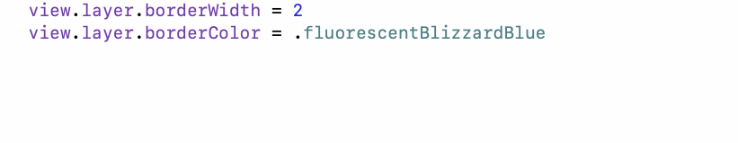
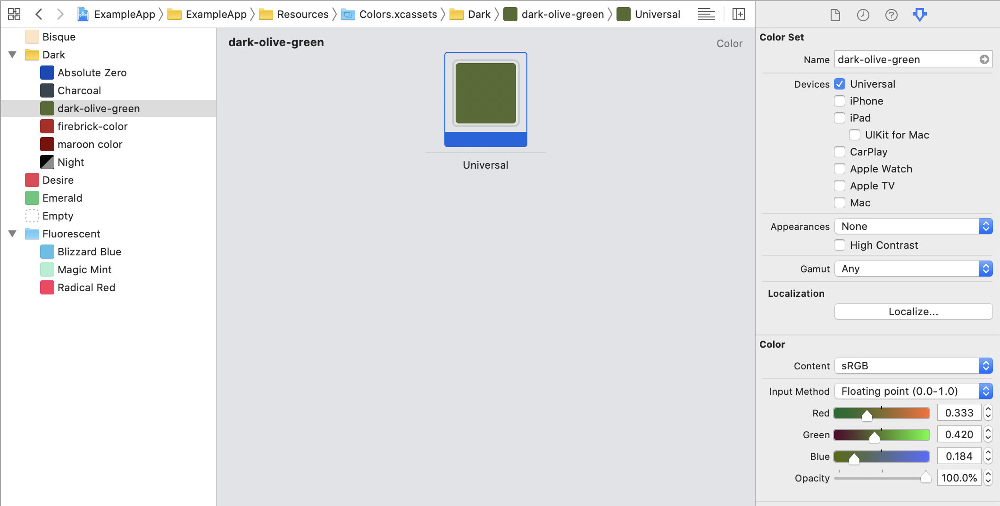

## CGColor Usage

Scans through asset catalogs.

### Xcode Editor Autocomplete



### Xcode Asset Catalog



### Backboard Generated Code

[ColorAsset.blackboard.swift](/ExampleApp/Source/Generated/ColorAsset.blackboard.swift)

```swift
public enum ColorAsset: String {
    case absoluteZero = "Absolute Zero"
    case bisque = "Bisque"
    case charcoal = "Charcoal"
    case darkOliveGreen = "dark-olive-green"
    case desire = "Desire"
    case emerald = "Emerald"
    case empty = "Empty"
    case firebrick = "firebrick-color"
    case fluorescentBlizzardBlue = "Fluorescent/Blizzard Blue"
    case fluorescentMagicMint = "Fluorescent/Magic Mint"
    case fluorescentRadicalRed = "Fluorescent/Radical Red"
    case maroon = "maroon color"
    case night = "Night"
}
```

[CGColor.blackboard.swift](/ExampleApp/Source/Generated/CGColor.blackboard.swift)

```swift
public extension ColorAsset {
    var cgColor: CGColor { return color.cgColor }
}

public extension CGColor {
    static var absoluteZero: CGColor { return ColorAsset.absoluteZero.cgColor }
    static var bisque: CGColor { return ColorAsset.bisque.cgColor }
    static var charcoal: CGColor { return ColorAsset.charcoal.cgColor }
    static var darkOliveGreen: CGColor { return ColorAsset.darkOliveGreen.cgColor }
    static var desire: CGColor { return ColorAsset.desire.cgColor }
    static var emerald: CGColor { return ColorAsset.emerald.cgColor }
    static var empty: CGColor { return ColorAsset.empty.cgColor }
    static var firebrick: CGColor { return ColorAsset.firebrick.cgColor }
    static var fluorescentBlizzardBlue: CGColor { return ColorAsset.fluorescentBlizzardBlue.cgColor }
    static var fluorescentMagicMint: CGColor { return ColorAsset.fluorescentMagicMint.cgColor }
    static var fluorescentRadicalRed: CGColor { return ColorAsset.fluorescentRadicalRed.cgColor }
    static var maroon: CGColor { return ColorAsset.maroon.cgColor }
    static var night: CGColor { return ColorAsset.night.cgColor }
}
```

### The Blackboard Way

[ExampleApp](/ExampleApp/Source/FooterViewController.swift#L46)
```swift
view.layer.borderColor = .fluorescentBlizzardBlue
```

### The Standard UIKit Way

[StandardApp](/StandardApp/Source/FooterViewController.swift#L46)
```swift
view.layer.borderColor = UIColor(named: "Fluorescent/Blizzard Blue")?.cgColor
```
