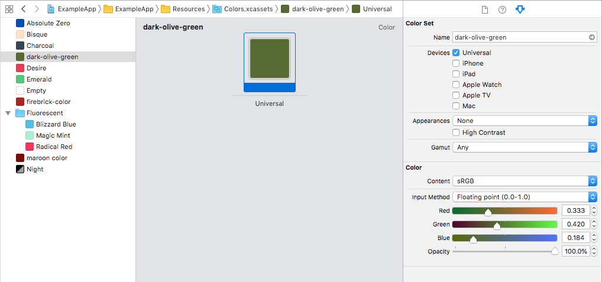

## CGColor Examples

Scans through asset catalogs.



### Backboard Generated Code

[CGColor.blackboard.swift](/ExampleApp/Source/Generated/CGColor.blackboard.swift)

```swift
extension CGColor {
    static var absoluteZero: CGColor
    static var bisque: CGColor
    static var charcoal: CGColor
    static var darkOliveGreen: CGColor
    static var desire: CGColor
    static var emerald: CGColor
    static var firebrick: CGColor
    static var fluorescentBlizzardBlue: CGColor
    static var fluorescentMagicMint: CGColor
    static var fluorescentRadicalRed: CGColor
    static var maroon: CGColor
    static var night: CGColor
}
```

```swift
extension CGColor {
    static var black: CGColor
    static var blue: CGColor
    static var brown: CGColor
    static var clear: CGColor
    static var cyan: CGColor
    static var darkGray: CGColor
    static var gray: CGColor
    static var green: CGColor
    static var lightGray: CGColor
    static var magenta: CGColor
    static var orange: CGColor
    static var purple: CGColor
    static var red: CGColor
    static var white: CGColor
    static var yellow: CGColor
}
```

### The Blackboard Way

[ExampleApp](/ExampleApp/Source/FooterViewController.swift#L46)
```swift
view.layer.borderColor = .fluorescentBlizzardBlue
```

### The Standard UIKit Way

[StandardApp](/StandardApp/Source/FooterViewController.swift#L46)
```swift
view.layer.borderColor = UIColor(named: "Fluorescent/Blizzard Blue")?.cgColor
```
