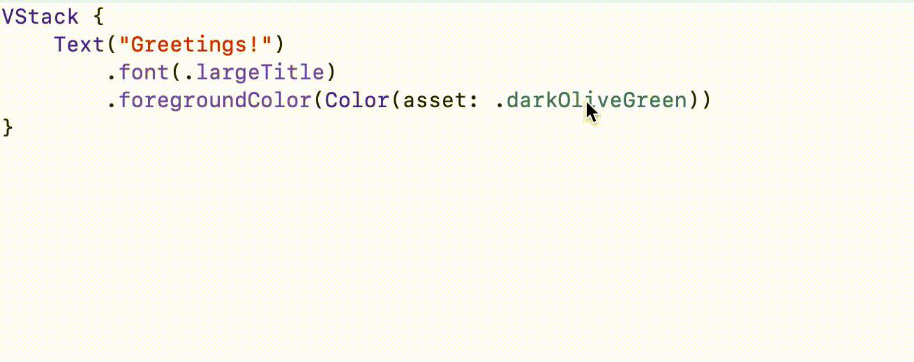

## Color Usage

Scans through asset catalogs.

### Xcode Editor Autocomplete



### Xcode Asset Catalog


### Backboard Generated Code

[ColorAsset.blackboard.swift](/DeclarativeApp/Source/Generated/ColorAsset.blackboard.swift#L9)

```swift
public enum ColorAsset: String {
    case absoluteZero = "Absolute Zero"
    case bisque = "Bisque"
    case charcoal = "Charcoal"
    case darkOliveGreen = "dark-olive-green"
    case desire = "Desire"
    case emerald = "Emerald"
    case empty = "Empty"
    case firebrick = "firebrick-color"
    case fluorescentBlizzardBlue = "Fluorescent/Blizzard Blue"
    case fluorescentMagicMint = "Fluorescent/Magic Mint"
    case fluorescentRadicalRed = "Fluorescent/Radical Red"
    case maroon = "maroon color"
    case night = "Night"
}
```

[Color.blackboard.swift](/DeclarativeApp/Source/Generated/Color.blackboard.swift#L14)

```swift
@available(iOS 13.0, *)
public extension Color {
    init(asset: ColorAsset)
    
    static var absoluteZero: Color
    static var bisque: Color
    static var charcoal: Color
    static var darkOliveGreen: Color
    static var desire: Color
    static var emerald: Color
    static var empty: Color
    static var firebrick: Color
    static var fluorescentBlizzardBlue: Color
    static var fluorescentMagicMint: Color
    static var fluorescentRadicalRed: Color
    static var maroon: Color
    static var night: Color
}
```

### The Blackboard Way

```swift
Color.darkOliveGreen
Color.fluorescentMagicMint

Color(asset: .darkOliveGreen)
Color(asset: .fluorescentMagicMint)
```

### The Standard SwiftUI Way

```swift
Color(named: "dark-olive-green")
Color(named: "Fluorescent/Magic Mint")
```
