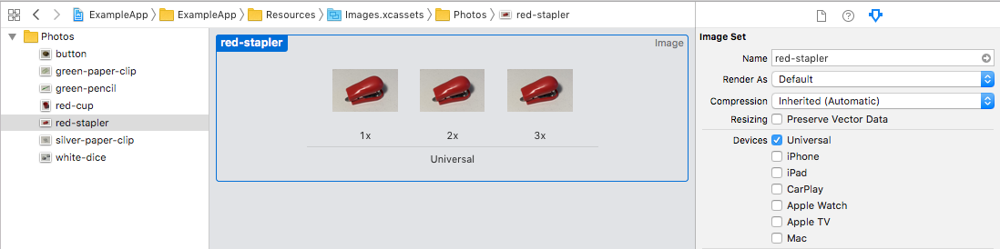

## Image Usage

Scans through asset catalogs.

### Xcode Editor Autocomplete


### Xcode SwiftUI Inspector


### Xcode Asset Catalog



### Backboard Generated Code

[ImageAsset.blackboard.swift](/ExampleApp/Source/Generated/ImageAsset.blackboard.swift)

```swift
public enum ImageAsset: String {
    case button
    case greenPaperClip = "green-paper-clip"
    case greenPencil = "green-pencil"
    case redCup = "Red/cup"
    case redStapler = "Red/stapler"
    case silverPaperClip = "silver-paper-clip"
    case whiteDice = "white-dice"
}
```

[Image.blackboard.swift](/ExampleApp/Source/Generated/Image.blackboard.swift)

```swift
public extension Image {
    
    init(asset imageAsset: ImageAsset) {
        self.init(imageAsset.rawValue, bundle: bundle)
    }
    
    init(asset imageAsset: ImageAsset, label: Text) {
        self.init(imageAsset.rawValue, bundle: bundle, label: label)
    }
    
    init(decorativeAsset imageAsset: ImageAsset) {
        self.init(decorative: imageAsset.rawValue, bundle: bundle)
    }
    
}
```

### The Blackboard Way

```swift
Image(asset: .redStapler)
Image(asset: .redStapler, label: Text("Red Stapler"))
Image(decorativeAsset: .redStapler)
```

### The Standard SwiftUI Way

```swift
Image("red-stapler")
Image("red-stapler", label: Text("Red Stapler"))
Image(decorative: "red-stapler")
```
