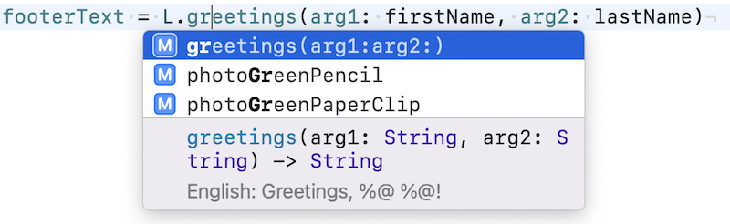

## L Convenience

Localization convenience.

### Xcode Editor Autocomplete



### Backboard Generated Code

[Localizable.blackboard.swift](/ExampleApp/Source/Generated/Localizable.blackboard.swift#L74)

```swift
public enum L {
    
    /// English: Checking
    public static var accountTypeChecking: String
    
    /// English: Roth IRA
    public static var accountTypeRoth: String
    
    /// English: Savings
    public static var accountTypeSavings: String
    
    /// English: Number of cookies: %d
    public static func cookieCount(cookies: CVarArg) -> String
    
    /// English: Days since last injury: %@
    public static func daysSinceLastInjury(numberOfDays: String) -> String
    
    /// English: Greetings, %@ %@!
    public static func greetings(firstName: String, lastName: String) -> String
    
    /// English: Seven
    public static var number7: String
    
    /// English: 100%%
    public static var oneHundredPercent: String
    
    /// English: Button
    public static var photoButton: String
    
    /// English: Green Paper Clip
    public static var photoGreenPaperClip: String
    
    /// English: Green Pencil
    public static var photoGreenPencil: String
    
    /// English: Red Cup
    public static var photoRedCup: String
    
    /// English: Silver Paper Clip
    public static var photoSilverPaperClip: String
    
    /// English: Stapler
    public static var photoStapler: String
    
    /// English: White Dice
    public static var photoWhiteDice: String
    
    /// English: Will it rain today?
    public static var willItRainToday: String
    
}
```

### The Blackboard Way

[ExampleApp](/ExampleApp/Source/MainViewController.swift#L45)
```swift
let firstName = "Steve"
let lastName = "Dave"
footerViewController.footerText = L.greetings(arg1: firstName, arg2: lastName)
```

### The Standard UIKit Way

[StandardApp](/StandardApp/Source/MainViewController.swift#L76)
```swift
let firstName = "Steve"
let lastName = "Dave"
let greetingsFormat = NSLocalizedString("greetings", comment: "")
footerViewController.footerText = .localizedStringWithFormat(greetingsFormat, firstName, lastName)
```
