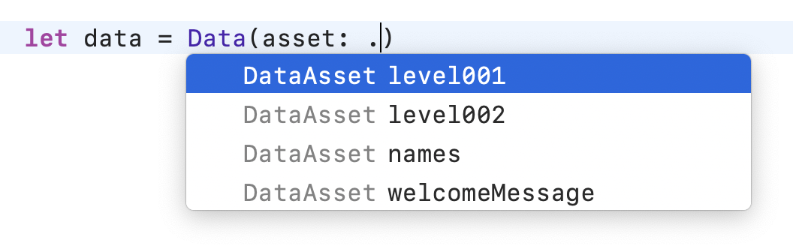
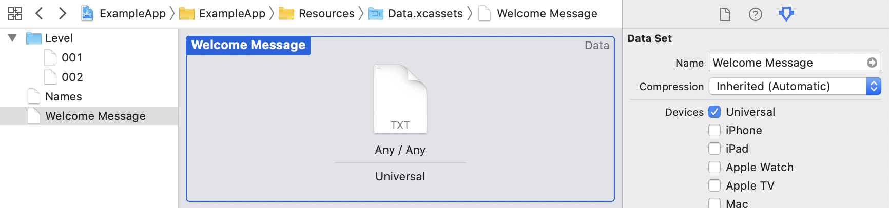

## NSDataAsset Usage

Scans through asset catalogs.

### Xcode Editor Autocomplete



### Xcode Asset Catalog



### Backboard Generated Code

[DataAsset.blackboard.swift](/ExampleApp/Source/Generated/DataAsset.blackboard.swift)

```swift
public enum DataAsset: String {
    case level001 = "Level/001"
    case level002 = "Level/002"
    case names = "Names"
    case welcomeMessage = "Welcome Message"
}
```

[NSDataAsset.blackboard.swift](/ExampleApp/Source/Generated/NSDataAsset.blackboard.swift)

```swift
public extension DataAsset {
    var dataAsset: NSDataAsset { return NSDataAsset(asset: self) }
    var data: Data { return dataAsset.data }
}

public extension NSDataAsset {
    
    convenience init(asset dataAsset: DataAsset) {
        self.init(name: dataAsset.rawValue, bundle: bundle)!
    }
    
}

public extension Data {
    
    init(asset dataAsset: DataAsset) {
        self = dataAsset.data
    }
    
}
```

### The Blackboard Way

```swift
let data = Data(asset: .welcomeMessage)
```

### The Standard UIKit Way

```swift
let data = NSDataAsset(name: "Welcome Message")?.data
```
