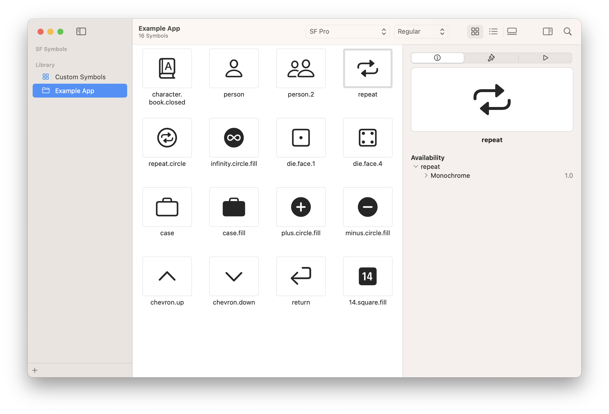

## Symbol Collection Usage

### Collection



### Blackboard Configuration

If a collection with the same name exists in the SF Symbols App, running Blackboard will update that collection with the provided symbols.

[.blackboard.yml](/.blackboard.yml#L1)

```yml
symbols-collection:
  name: Example App

symbols:
- a.book.closed
- 14.square.fill
- case
- case.fill
- character.book.closed
- chevron.down
- chevron.up
- die.face.1
- die.face.4
- infinity.circle.fill
- minus.circle.fill
- person
- person.2
- plus.circle.fill
- return
- repeat
- repeat.circle
```
