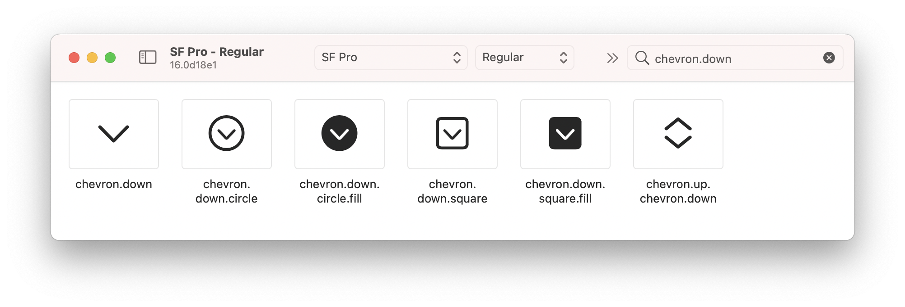

## Symbol Image Usage

### Symbols



### Blackboard Configuration

[.blackboard.yml](/.blackboard.yml#L1)

```yml
symbols:
- 14.square.fill
- case
- case.fill
- chevron.down
- chevron.up
- die.face.1
- die.face.4
- infinity.circle.fill
- minus.circle.fill
- person
- person.2
- plus.circle.fill
- return
- repeat
- repeat.circle
```

### Backboard Generated Code

[SymbolAsset.blackboard.swift](/ExampleApp/Source/Generated/SymbolAsset.blackboard.swift#L9)

```swift
@available(iOS 13.0, *)
public enum SymbolAsset: String {
    @available(iOS 14.0, *)
    case caseSymbol = "case"
    @available(iOS 14.0, *)
    case caseSymbolFill = "case.fill"
    case chevronDown = "chevron.down"
    case chevronUp = "chevron.up"
    @available(iOS 14.0, *)
    case dieFace1 = "die.face.1"
    @available(iOS 14.0, *)
    case dieFace4 = "die.face.4"
    @available(iOS 14.2, *)
    case infinityCircleFill = "infinity.circle.fill"
    case minusCircleFill = "minus.circle.fill"
    case number14SquareFill = "14.square.fill"
    case person
    case person2 = "person.2"
    case plusCircleFill = "plus.circle.fill"
    case repeatSymbol = "repeat"
    @available(iOS 14.2, *)
    case repeatSymbolCircle = "repeat.circle"
    case returnSymbol = "return"
}
```

[SymbolImage.blackboard.swift](/ExampleApp/Source/Generated/SymbolImage.blackboard.swift#L9)

```swift
@available(iOS 13.0, *)
public extension Image {
    init(symbol: SymbolAsset)
    
    @available(iOS 14.0, *)
    static var caseSymbol: Image
    @available(iOS 14.0, *)
    static var caseSymbolFill: Image
    static var chevronDown: Image
    static var chevronUp: Image
    @available(iOS 14.0, *)
    static var dieFace1: Image
    @available(iOS 14.0, *)
    static var dieFace4: Image
    @available(iOS 14.2, *)
    static var infinityCircleFill: Image
    static var minusCircleFill: Image
    static var number14SquareFill: Image
    static var person: Image
    static var person2: Image
    static var plusCircleFill: Image
    static var repeatSymbol: Image
    @available(iOS 14.2, *)
    static var repeatSymbolCircle: Image
    static var returnSymbol: Image    
}
```

### The Blackboard Way

```swift
Image.chevronDown

Image(symbol: .chevronDown)
```

### The Standard SwiftUI Way

```swift
Image(systemName: "chevron.down")
```
