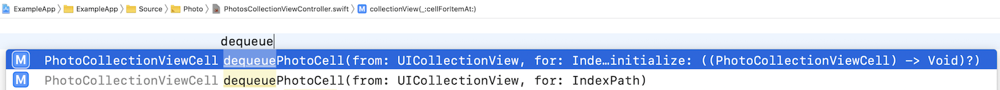
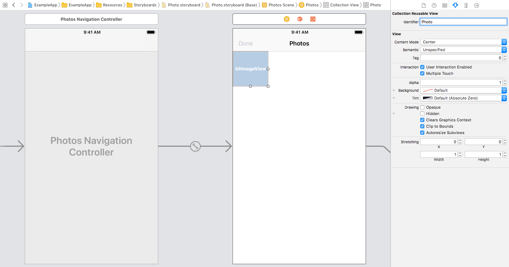

## Dequeue Collection View Cell Usage

Scans through storyboards.

### Xcode Editor Autocomplete



### Storyboard Identifier



### Backboard Generated Code

[PhotoStoryboard.blackboard.swift](/DeclarativeApp/Source/Generated/PhotoStoryboard.blackboard.swift)

```swift
final func dequeuePhotoCell(from collectionView: UICollectionView, for indexPath: IndexPath,
                            initialize: ((_ photoCell: PhotoCollectionViewCell) -> Void)? = nil) -> PhotoCollectionViewCell
```

### The Blackboard Way

```swift
override func collectionView(_ collectionView: UICollectionView, cellForItemAt indexPath: IndexPath) -> UICollectionViewCell {
    let photoViewModel = photoViewModels[indexPath.item]
    return dequeuePhotoCell(from: collectionView, for: indexPath) { cell in
        cell.imageView.image = photoViewModel.image
    }
}
```

### The Standard UIKit Way

```swift
override func collectionView(_ collectionView: UICollectionView, cellForItemAt indexPath: IndexPath) -> UICollectionViewCell {
    let photoViewModel = photoViewModels[indexPath.item]
    let cell = collectionView.dequeueReusableCell(withReuseIdentifier: "Photo", for: indexPath) as! PhotoCollectionViewCell
    cell.imageView.image = photoViewModel.image
    return cell
}
```
