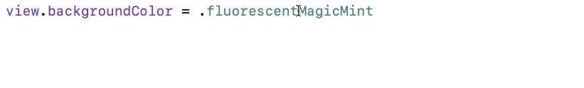

## UIColor Usage

Scans through asset catalogs.

### Xcode Editor Autocomplete



### Xcode Asset Catalog


### Backboard Generated Code

[ColorAsset.blackboard.swift](/ExampleApp/Source/Generated/ColorAsset.blackboard.swift)

```swift
public enum ColorAsset: String {
    case absoluteZero = "Absolute Zero"
    case bisque = "Bisque"
    case charcoal = "Charcoal"
    case darkOliveGreen = "dark-olive-green"
    case desire = "Desire"
    case emerald = "Emerald"
    case empty = "Empty"
    case firebrick = "firebrick-color"
    case fluorescentBlizzardBlue = "Fluorescent/Blizzard Blue"
    case fluorescentMagicMint = "Fluorescent/Magic Mint"
    case fluorescentRadicalRed = "Fluorescent/Radical Red"
    case maroon = "maroon color"
    case night = "Night"
}
```

[UIColor.blackboard.swift](/ExampleApp/Source/Generated/UIColor.blackboard.swift)

```swift
public extension ColorAsset {
    var color: UIColor { return UIColor(asset: self) }
}

public extension UIColor {
    
    convenience init(asset colorAsset: ColorAsset, compatibleWith traitCollection: UITraitCollection? = nil) {
        self.init(named: colorAsset.rawValue, in: bundle, compatibleWith: traitCollection)!
    }
    
    static var absoluteZero: UIColor { return UIColor(asset: ColorAsset.absoluteZero) }
    static var bisque: UIColor { return UIColor(asset: ColorAsset.bisque) }
    static var charcoal: UIColor { return UIColor(asset: ColorAsset.charcoal) }
    static var darkOliveGreen: UIColor { return UIColor(asset: ColorAsset.darkOliveGreen) }
    static var desire: UIColor { return UIColor(asset: ColorAsset.desire) }
    static var emerald: UIColor { return UIColor(asset: ColorAsset.emerald) }
    static var empty: UIColor { return UIColor(asset: ColorAsset.empty) }
    static var firebrick: UIColor { return UIColor(asset: ColorAsset.firebrick) }
    static var fluorescentBlizzardBlue: UIColor { return UIColor(asset: ColorAsset.fluorescentBlizzardBlue) }
    static var fluorescentMagicMint: UIColor { return UIColor(asset: ColorAsset.fluorescentMagicMint) }
    static var fluorescentRadicalRed: UIColor { return UIColor(asset: ColorAsset.fluorescentRadicalRed) }
    static var maroon: UIColor { return UIColor(asset: ColorAsset.maroon) }
    static var night: UIColor { return UIColor(asset: ColorAsset.night) }
    
}
```

### The Blackboard Way

[ExampleApp](/ExampleApp/Source/FooterViewController.swift#L43)
```swift
view.backgroundColor = .fluorescentMagicMint
```

### The Standard UIKit Way

[StandardApp](/StandardApp/Source/FooterViewController.swift#L43)
```swift
view.backgroundColor = UIColor(named: "Fluorescent/Magic Mint")
```
