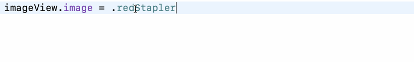
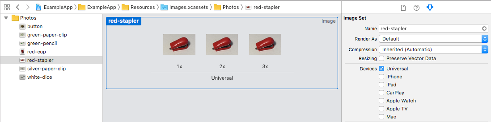

## UIImage Usage

Scans through asset catalogs.

### Xcode Editor Autocomplete



### Xcode Asset Catalog



### Backboard Generated Code

[ImageAsset.blackboard.swift](/DeclarativeApp/Source/Generated/ImageAsset.blackboard.swift#L9)

```swift
public enum ImageAsset: String {
    case button
    case greenPaperClip = "green-paper-clip"
    case greenPencil = "green-pencil"
    case redCup = "Red/cup"
    case redStapler = "Red/stapler"
    case silverPaperClip = "silver-paper-clip"
    case whiteDice = "white-dice"
}
```

[UIImage.blackboard.swift](/DeclarativeApp/Source/Generated/UIImage.blackboard.swift#L14)

```swift
public extension ImageAsset {
    var image: UIImage
}

public extension UIImage {
    init(asset: ImageAsset, compatibleWith traitCollection: UITraitCollection? = nil)
    
    static var button: UIImage
    static var greenPaperClip: UIImage
    static var greenPencil: UIImage
    static var redCup: UIImage
    static var redStapler: UIImage
    static var silverPaperClip: UIImage
    static var whiteDice: UIImage
}
```

### The Blackboard Way

```swift
imageView.image = .redStapler

imageView.image = UIImage(asset: .redStapler)
imageView.image = UIImage(asset: .redStapler, compatibleWith: traitCollection)
```

### The Standard UIKit Way

```swift
imageView.image = UIImage(named: "red-stapler")
imageView.image = UIImage(named: "red-stapler", compatibleWith: traitCollection)
```
