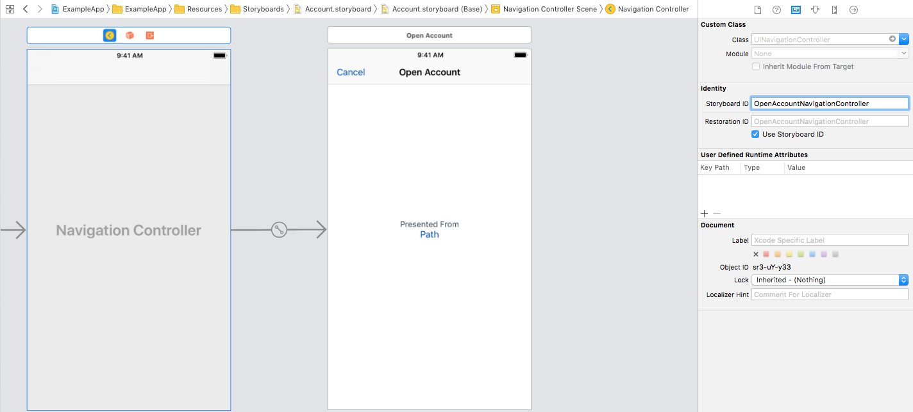

## Instantiate Navigation Controller Usage

Scans through storyboards.



### Backboard Generated Code

[Account.blackboard.swift](/ExampleApp/Source/Generated/Account.blackboard.swift)

```swift
final class func instantiateNavigationControllerFromStoryboard(_ initialize: ((_ openAccountViewController: OpenAccountViewController) -> Void)? = nil) -> UINavigationController
```

### The Blackboard Way

[ExampleApp](/ExampleApp/Source/AccountsTableViewController.swift#L99)
```swift
@IBAction func presentOpenAccount() {
    let navigationController = OpenAccountViewController.instantiateNavigationControllerFromStoryboard { openAccountViewController in
        openAccountViewController.path = "Instantiate Navigation Controller"
    }
    present(navigationController, animated: true)
}
```

### The Standard UIKit Way

[StandardApp](/StandardApp/Source/AccountsTableViewController.swift#L110)
```swift
@IBAction func presentOpenAccount() {
    let storyboard = UIStoryboard(name: "Account", bundle: nil)
    let navigationController = storyboard.instantiateViewController(withIdentifier: "OpenAccountNavigationController") as! UINavigationController
    let openAccountViewController = navigationController.viewControllers.first as! OpenAccountViewController
    openAccountViewController.path = "Instantiate Navigation Controller"
    present(navigationController, animated: true)
}
```
