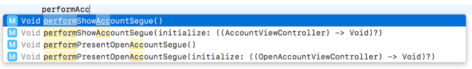
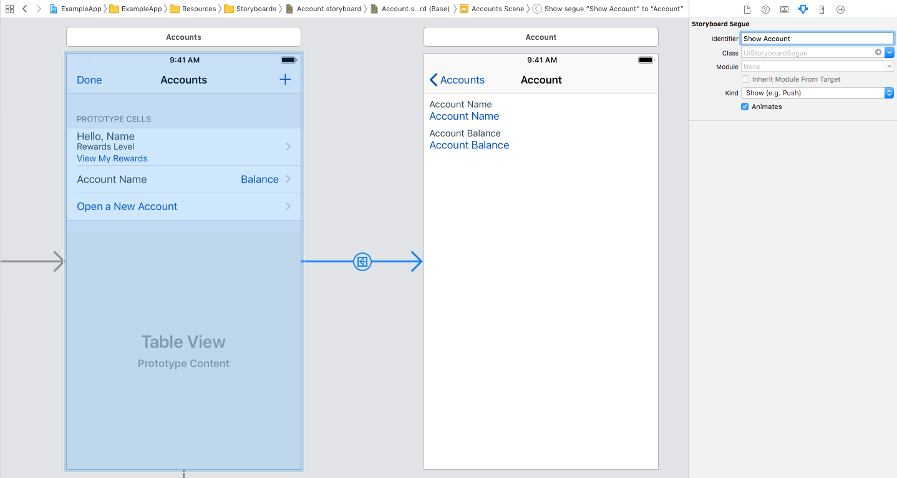

## Perform Segue Usage

Scans through storyboards.

### Xcode Editor Autocomplete



### Storyboard Identifier



### Backboard Generated Code

[AccountStoryboard.blackboard.swift](/ExampleApp/Source/Generated/AccountStoryboard.blackboard.swift)

```swift
final func performPresentOpenAccountSegue(_ initialize: ((OpenAccountViewController) -> Void)? = nil)

final func performShowAccountSegue(_ initialize: ((AccountViewController) -> Void)? = nil)
```

### The Blackboard Way

[ExampleApp](/ExampleApp/Source/AccountsTableViewController.swift#L88)
```swift
override func tableView(_ tableView: UITableView, didSelectRowAt indexPath: IndexPath) {
    switch Section(rawValue: indexPath.section)! {
    case .overview:
        break
    case .accounts:
        let accountViewModel = accountViewModels[indexPath.row]
        performShowAccountSegue { accountViewController in
            accountViewController.viewModel = accountViewModel
        }
    case .openNewAccount:
        performPresentOpenAccountSegue { openAccountViewController in
            openAccountViewController.path = "Perform Segue"
        }
    }
}
```

### The Standard UIKit Way

```swift
override func prepare(for segue: UIStoryboardSegue, sender: Any?) {
    if segue.identifier == "Show Account" {
        if let accountViewController = segue.destination as? AccountViewController {
            let accountViewModel = sender as? AccountViewModel
            accountViewController.viewModel = accountViewModel
        }
    }
    else if segue.identifier == "Present Open Account" {
        if let navigationController = segue.destination as? UINavigationController,
            let openAccountViewController = navigationController.viewControllers.first as? OpenAccountViewController {
            openAccountViewController.path = "Perform Segue"
        }
    }
}

override func tableView(_ tableView: UITableView, didSelectRowAt indexPath: IndexPath) {
    switch Section(rawValue: indexPath.section)! {
    case .overview:
        break
    case .accounts:
        let accountViewModel = accountViewModels[indexPath.row]
        performSegue(withIdentifier: "Show Account", sender: accountViewModel)
    case .openNewAccount:
        performSegue(withIdentifier: "Present Open Account", sender: nil)
    }
}
```
