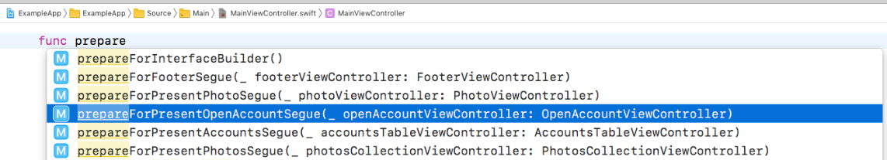

## Prepare Segue Usage

Scans through storyboards.

### Xcode Editor Autocomplete



### Backboard Generated Code

[MainStoryboard.blackboard.swift](/ExampleApp/Source/Generated/MainStoryboard.blackboard.swift)

```swift
func prepareForFooterSegue(_ footerViewController: FooterViewController)
```

### The Blackboard Way

[ExampleApp](/ExampleApp/Source/MainViewController.swift#L36)
```swift
func prepareForFooterSegue(_ footerViewController: FooterViewController) {
    self.footerViewController = footerViewController
}
```

### The Standard UIKit Way

[StandardApp](/StandardApp/Source/MainViewController.swift#L37)
```swift
override func prepare(for segue: UIStoryboardSegue, sender: Any?) {
    if let footerViewController = segue.destination as? FooterViewController {
        self.footerViewController = footerViewController
    }
}
```
