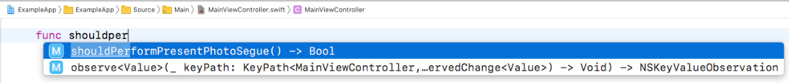

## Should Perform Segue Usage

Scans through storyboards.

### Xcode Editor Autocomplete



### Backboard Generated Code

[MainStoryboard.blackboard.swift](/DeclarativeApp/Source/Generated/MainStoryboard.blackboard.swift)

```swift
func shouldPerformPresentPhotoSegue() -> Bool
```

### The Blackboard Way

```swift
func shouldPerformPresentPhotoSegue() -> Bool {
    return PhotoViewModel.examples.first != nil
}
```

### The Standard UIKit Way

```swift
override func shouldPerformSegue(withIdentifier identifier: String, sender: Any?) -> Bool {
    if identifier == "Present Photo" {
        return PhotoViewModel.examples.first != nil
    }
    return true
}
```
