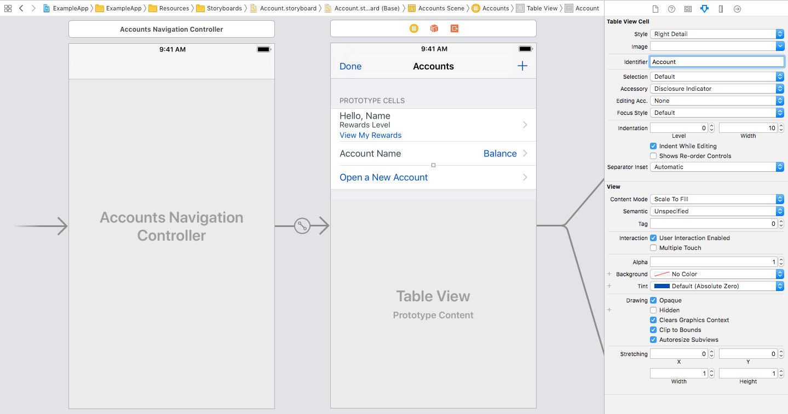

## Dequeue Table View Cell Usage

Scans through storyboards.



### Backboard Generated Code

[Account.blackboard.swift](/ExampleApp/Source/Generated/Account.blackboard.swift)

```swift
final func dequeueAccountCell(from tableView: UITableView, for indexPath: IndexPath,
                              initialize: ((_ accountCell: AccountTableViewCell) -> Void)? = nil) -> AccountTableViewCell

final func dequeueAccountOverviewCell(from tableView: UITableView, for indexPath: IndexPath,
                                      initialize: ((_ accountOverviewCell: AccountOverviewTableViewCell) -> Void)? = nil) -> AccountOverviewTableViewCell

final func dequeueOpenNewAccountCell(from tableView: UITableView, for indexPath: IndexPath,
                                     initialize: ((_ cell: UITableViewCell) -> Void)? = nil) -> UITableViewCell
```

### The Blackboard Way

[ExampleApp](/ExampleApp/Source/AccountsTableViewController.swift#L67)
```swift
override func tableView(_ tableView: UITableView, cellForRowAt indexPath: IndexPath) -> UITableViewCell {
    switch Section(rawValue: indexPath.section)! {
    case .overview:
        return dequeueAccountOverviewCell(from: tableView, for: indexPath) { cell in
            cell.helloLabel.text = self.viewModel.helloText
            cell.rewardsLevelLabel.text = self.viewModel.rewardsLevelText
        }
    case .accounts:
        let accountViewModel = accountViewModels[indexPath.row]
        return dequeueAccountCell(from: tableView, for: indexPath) { cell in
            cell.nameLabel.text = accountViewModel.name
            cell.balanceLabel.text = accountViewModel.balance
        }
    case .openNewAccount:
        return dequeueOpenNewAccountCell(from: tableView, for: indexPath)
    }
}
```

### The Standard UIKit Way

[StandardApp](/StandardApp/Source/AccountsTableViewController.swift#L82)
```swift
override func tableView(_ tableView: UITableView, cellForRowAt indexPath: IndexPath) -> UITableViewCell {
    switch Section(rawValue: indexPath.section)! {
    case .overview:
        let cell = tableView.dequeueReusableCell(withIdentifier: "Account Overview", for: indexPath) as! AccountOverviewTableViewCell
        cell.helloLabel.text = viewModel.helloText
        cell.rewardsLevelLabel.text = viewModel.rewardsLevelText
        return cell
    case .accounts:
        let accountViewModel = accountViewModels[indexPath.row]
        let cell = tableView.dequeueReusableCell(withIdentifier: "Account", for: indexPath) as! AccountTableViewCell
        cell.nameLabel.text = accountViewModel.name
        cell.balanceLabel.text = accountViewModel.balance
        return cell
    case .openNewAccount:
        return tableView.dequeueReusableCell(withIdentifier: "Open New Account", for: indexPath)
    }
}
```
