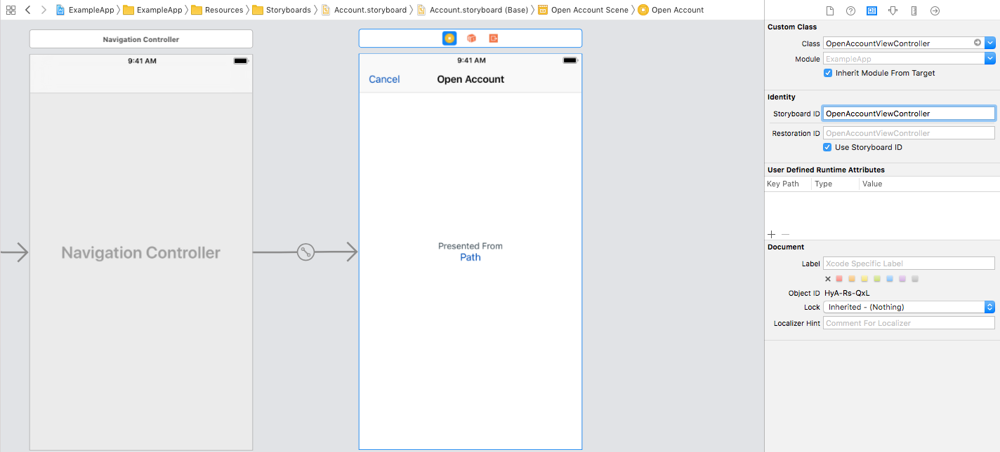

## UIViewController Examples



### Backboard Generated Code

[Account.blackboard.swift](/ExampleApp/Source/Generated/Account.blackboard.swift)

```swift
final class func instantiateFromStoryboard(_ initialize: ((_ openAccountViewController: OpenAccountViewController) -> Void)? = nil) -> OpenAccountViewController
```

### The Blackboard Way

[ExampleApp](/ExampleApp/Source/AccountsTableViewController.swift#L106)
```swift
@IBAction func presentOpenAccount() {
    let openAccountViewController = OpenAccountViewController.instantiateFromStoryboard()
    openAccountViewController.path = "Instantiate View Controller"
    
    let navigationController = UINavigationController(rootViewController: openAccountViewController)
    present(navigationController, animated: true)
}
```

### The Standard UIKit Way

[StandardApp](/StandardApp/Source/AccountsTableViewController.swift#L118)
```swift
@IBAction func alternativePresentOpenAccount() {
    let storyboard = UIStoryboard(name: "Account", bundle: nil)
    let openAccountViewController = storyboard.instantiateViewController(withIdentifier: "OpenAccountViewController") as! OpenAccountViewController
    openAccountViewController.path = "Instantiate View Controller"
    
    let navigationController = UINavigationController(rootViewController: openAccountViewController)
    present(navigationController, animated: true)
}
```
